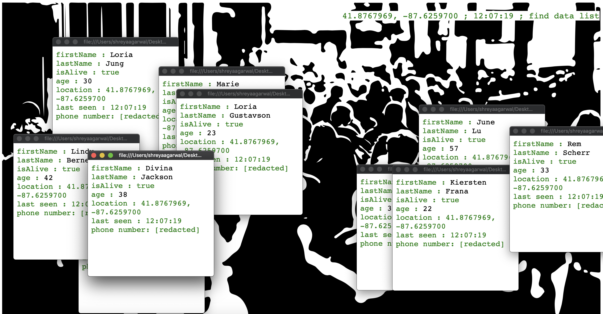

### Idea No. 101
# Sophia

#### Sophia is a social humanoid robot developed by Hong Kong based company Hanson Robotics, activated on February 14, 2016. Humanoid robotics is an important branch of biomimetic robotics and is not only associated with science and engineering disciplines but also deeply connected to social, legal, and ethical domains.

With a disputed history and origin that is said to date back to the Automaton and Leonardo Da Vinci, the humanoid robot is a robot with its body shape built to resemble the human body. The design may be for functional purposes, such as interacting with human tools and environments, or for experimental purposes, such as the study of bipedal locomotion, or for other purposes.

 Sophia is a humanoid robot who is modeled after the actress Audrey Hepburn.  In 1966, Joseph Weizenbaum attempted to simulate a human conversation between a human and computer using a computer program called ELIZA, Sophia is conceptually similar. Sophia uses artificial intelligence, visual data processing and facial recognition to imitate human gestures and facial expressions. She can even answer certain questions and make simple conversations on predefined topics (e.g. on the weather). Sophia uses voice recognition (speech-to-text) technology from Alphabet Inc. (parent company of Google) and is designed to get smarter over time.

Hanson designed Sophia to be a suitable companion for the elderly at nursing homes, and to help crowds at large events or parks. He hopes that the robot can ultimately interact with other humans sufficiently to gain social skills. He has said that Sophia would ultimately be a good fit to serve in healthcare, customer service, therapy and education. Sophia runs on artificially intelligent software that is constantly being trained in the lab, so its conversations are likely to get faster, Sophia's expressions are likely to have fewer errors, and it should answer increasingly complex questions with more accuracy.

Sophia is the robotic talk of town due to the fact that she is the first robot to have been granted citizenship. She has even mentioned in interviews that she "wants a child". Sophia has nine robot humanoid “siblings” who were also created by Hanson Robotics. Sophia is just the beginning of a revolution that is to come with the further advancements in robotics and artificial intelligence.

> Artist Shreya Agarwal repaints the relationship between humans and humanoid robots through the eyes of the early 2000s popular robot, Sophia.
